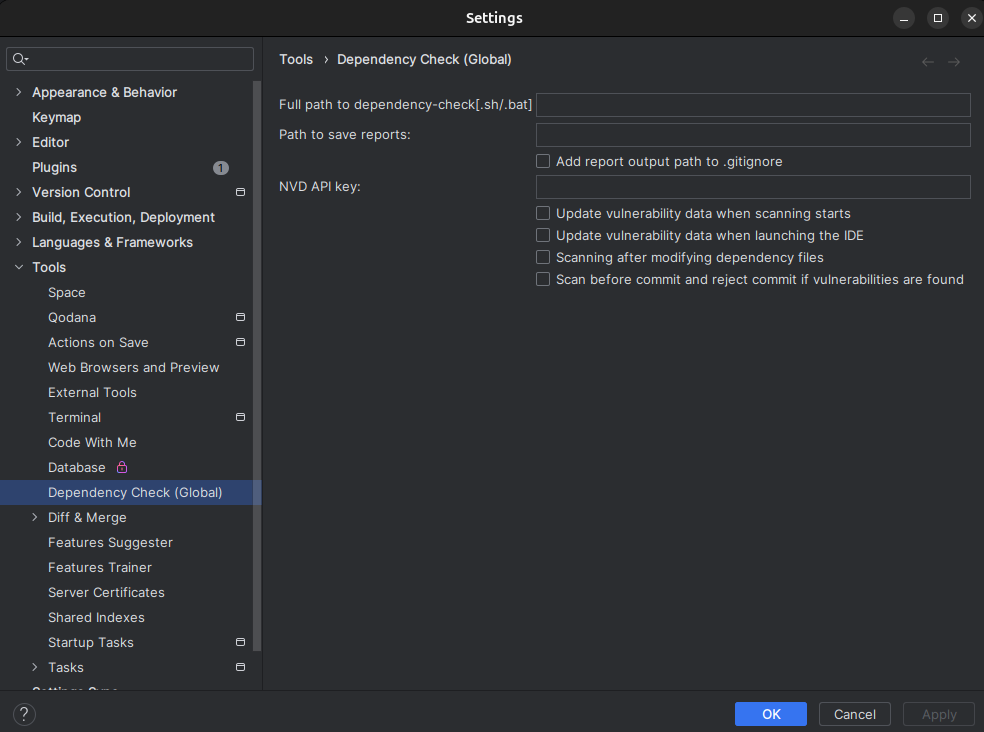
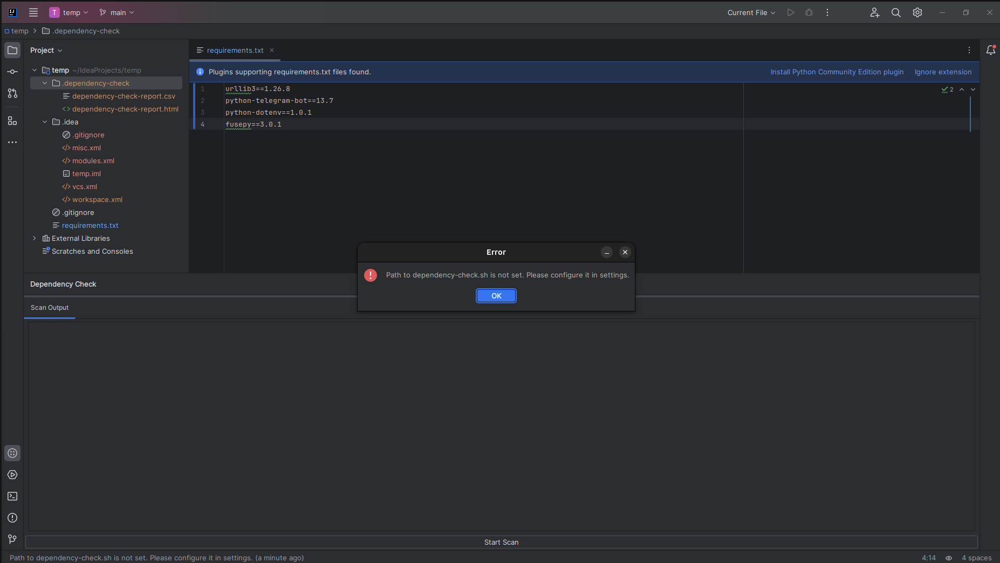

# INT-31-Лавренов_Дмитрий

<!-- Plugin description -->

Плагин для IntelliJ Idea для поиска уязвимостей в зависимостях с помощью установленного локально
[OWASP Dependency Check Command Line](https://owasp.org/www-project-dependency-check/)

<!-- Plugin description end -->

## Сборка

### 1) .jar для установки плагина
В корневой директории проекта `dependency-check-plugin` запустить команду:

`Linux/Mac`:
```shell
./gradlew build
```

`Windows`:
```shell
gradlew.bat build
```

В директории `dependency-check-plugin/build/libs` будет архив `dependency-check-plugin-0.0.1.jar`

Далее его можно установить в IDE с диска:


### 2) Сборка плагина с запуском IDE
В корневой директории проекта `dependency-check-plugin` запустить команду:

`Linux/Mac`:
```shell
./gradlew runIde
```

`Windows`:
```shell
gradlew.bat runIde
```

### 3) Тесты

**В ветке main нет UI тестов, инструкция по их запуску будет далее**

#### Без UI тестов
В корневой директории проекта `dependency-check-plugin` запустить команду:

`Linux/Mac`:
```shell
./gradlew test
```

`Windows`:
```shell
gradlew.bat test
```

#### Для запуска UI тестов (В этой конфигурации файл .jar не собрать)
- Нужно клонировать ветку `ui-test`

- В корневой директории проекта запустить команду:

`Linux/Mac`:
```shell
./gradlew runIdeForUiTests
```

`Windows`:
```shell
gradlew.bat runIdeForUiTests
```

- Далее, не останавливая исполнение предыдущей команды, запустить:  

`Linux/Mac`:
```shell
./gradlew test
```

`Windows`:
```shell
gradlew.bat test
```

## Описание плагина

Этот плагин предполагает, что [OWASP Dependency Check Command Line](https://owasp.org/www-project-dependency-check/)
установлен локально на системе в формате `Command Line`

Для конфигурации плагина нужно зайти в его глобальные настройки(настройки только для проекта не реализованы):



Где:
- `Full path to dependency-checg[.sh/.bat]` - обязательное значение. Путь до скрипта анализатора. .sh и .bat для
Linux/Mac и Windows, соответственно.
Пример значения: `/home/kekov/Desktop/dependency-check-9.2.0-release/dependency-check/bin/dependency-check.sh`
- `Path to save reports` - опциональное значение. Полный путь директории для сохранения результатов сканирования. По умолчанию 
они сохраняются в папку `.dependency-check` в корневой директории открытого проекта.
- `NVD API Key` - обязательное значение. Ключ для NVD API.
- `Add report output path to .gitignore` - добавлять ли директорию с результатами сканирования в `.gitignore`. Если
до этого она была добавлена и после убрать галочку, то указание из `.gitignore` будет удалено
- `Update vulnerability data when scanning starts` - обновлять ли локальный репозиторий уязвимостей при каждом запуске
сканирования.
- `Update vulnerability data when launching the IDE` - обновлять ли локальный репозиторий уязвимостей при каждом запуске
  IDE.
- `Scanning after modifying dependency files` - запускать ли сканирование при каждом изменении файлов с зависимостями.
Может работать с небольшой задержкой, в качестве подобных файлов добавлены все поддерживаемые сканером форматы, кроме .js

Само сканирование запускается по кнопке `Start Scan`:


Если не указать обязательные параметры, то сканирование не запустится и появится сообщение об ошибке:



Процесс сканирования выводится в виде текста и прогресс-бара (фейкового):


Краткий результат сканирования выводится в виде таблицы:


Также можно нажать на ссылку в нижней части окна и откроются подробные результаты:


Все информационные сообщения выводятся в виде уведомлений:


При выборе опции обновления при каждом старте IDE его прогресс выводится в виде виджета:  


При попытке сделать коммит, изначально будет сообщение о том, что нужно запустить сканирование вручную:


Если уязвимости были найдены, то при попытке коммита он не даст его сделать:


Если уязвимостей нет, то коммит будет разрешен:
